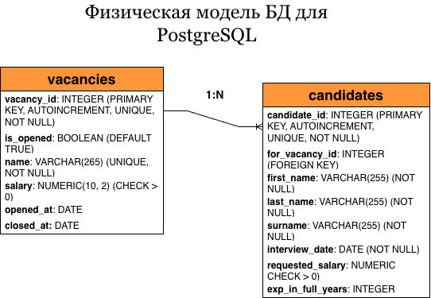

# НПЦ ИРС
Тестовое задание для НПЦ ИРС

Данная модель БД описывает две сущности: Вакансия (vacancy) и кандидат (сandidate).<br>
Вакансия и кандидат связаны внешним ключом по полю *for_vacancy_id* кандидата, связью 1 ко многим.<br>
Много кандидатов на одну вакансию, остальные поля описаны в Физической модели БД на схеме ниже.<br>

<p align="center">

</p>

Данная БД создается и заполняется произвольными данными файлом, лежащим в корне проекта, под названием init-db.sql.<br>
<br>
Чтобы создать новую БД в соответствии с физической моделью выше, запустите команду в терминале: <br>
```bash
psql -U postgres -d postgres -f /путь/к/файлу/init-db.sql
```
Если вы находитесь в корне проекта, запустите команду:<br>
```bash
psql -U postgres -d postgres -f ./init-db.sql
```
Чтобы подключиться к только что созданной БД, запустите команду:<br>
```bash
psql -U postgres -d npc_irc_db
```
