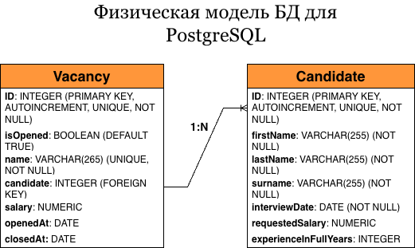

# НПЦ ИРС
Тестовое задание для НПЦ ИРС

Модель БД описывает две сущности: Вакансия (Vacancy) и Кандидат (Candidate). 
Вакансия и кандидат связаны внешним ключом по полю candidate связью 1 ко многим. 
Много кандидатов на одну вакансию, остальные поля описаны в Физической модели БД на схеме ниже. 

Данная БД создается и заполняется произвольными данными файлом, лежащим в корне проекта, под названием init-db.sql
